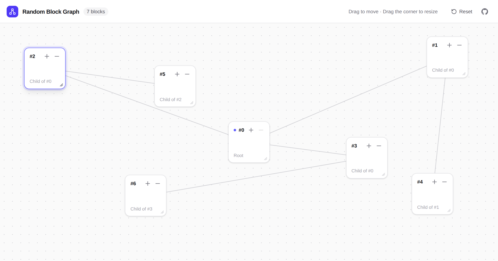

# Random Block Graph Generator

Build random block graphs in your browser. Add, drag, resize and delete blocks; every block stays connected to its parent by a line.

**Live demo: [random-block-graph-generator.vercel.app](https://random-block-graph-generator.vercel.app)**

[](https://random-block-graph-generator.vercel.app)

## Features

- Block Creation: Click the `+` button on any block to add a child block. The new block is placed randomly on the canvas.

- Block Deletion: Click the `−` button on any block except the root block. The block, all of its descendant blocks and their lines are removed.

- Block Movement: Drag a block with a mouse, pen or finger to move it. The active block is highlighted and always stays inside the canvas, and its lines follow it.

- Block Resizing: Drag the grip in a block's bottom-right corner to resize it. Blocks can't be made smaller than 100 × 100 px.

- Line Drawing: Lines connect the centers of each block and its parent block, showing the relationship between blocks.

- Reset: The Reset button in the header clears the graph back to a single root block. The header also shows the current block count.

- Light and dark themes follow your system setting.

## Tech Stack

React 19, TypeScript, Vite and Tailwind CSS.

## How to Run the Project

Requires [Node.js](https://nodejs.org/) 20.19+ or 22.13+.

1. **Clone the repository**: First, you need to clone the repository to your local machine. You can do this by running the following command in your terminal:

   ```bash
   git clone https://github.com/salehinafnan/random-block-graph-generator.git
   ```

2. **Install the necessary packages**: Navigate into the project directory and run the following command to install all the necessary packages:

   ```bash
   cd random-block-graph-generator
   npm install
   ```

3. **Start the development server**: Finally, you can start the development server by running the following command:

   ```bash
   npm run dev
   ```

   The application should now be running at `http://localhost:5173`.

## Scripts

- `npm run dev`: Start the development server
- `npm run build`: Type-check and build the project for production into `dist`
- `npm run preview`: Preview the production build locally
- `npm run lint`: Lint the project with ESLint
- `npm run format`: Format the project with Prettier

## Deployment

The app is deployed on [Vercel](https://vercel.com) at [random-block-graph-generator.vercel.app](https://random-block-graph-generator.vercel.app). Vercel detects the Vite setup automatically, building with `npm run build` and serving the `dist` folder.
